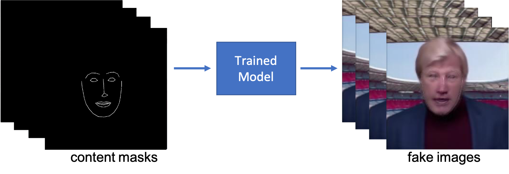

# vid2vid in PyTorch

This is a video to video translation of portrait perspective videos built upon a [pix2pix](https://arxiv.org/abs/1611.07004) model. The idea is to have a character S (style) say something on behalf of character C (content). As input data you need two quadratically shaped portrait perspective videos, one of character S and one of character C. Only the video of character C needs to have an audio line, the audio of S is ignored.

<p align="center"></p>

The main part of this repo is a pix2pix implementation which can easily be used for other applications other than vid2vid, as well.

In short, the following pipeline describes the vid2vid procedure step by step:

1. The video of character S is sliced into numerous individual images. This video is labeled the *style* video, as it represents the target style of the project.

2. A pertained facial landmark detector is used to extract the facial landmarks of these images in order to create a facial mask of each image.

3. The results of the previous two steps are concatenated to a training set. I.e., the facial masks from step 2 provide the training data and the raw images from step 1 provide the training labels.

<p align="center"></p>

4. A pix2pix model is trained based on the training data from step 3.

5. A test set is created by repeating steps 1 and 2 using a second video. This second video is labeled the *content* video, as the facial masks of this video represent the target content of the project.

<p align="center"></p>

6. The test data from step 5 is put through the trained model from step 4 which results in a set of *fake* images.
<p align="center"></p>

7. The fake images from step 6 are concatenated to a video to which the audio from the *content* video is added. The result is a *fake* video with style of the *style* video, content of the *content* video, and audio of the *content* video.

## Prerequisites
* Python 3
* GPU + CUDA (for testing also on CPU possible)
## Installation


1. Clone this repo
```
git clone
```
2. Install the dependencies:
```
pip install -r dependencies.txt
```
3. Download data (you could also use your own data right away but at the very least you need to download the facial landmark model). Run:
```
python download_data.py
```
If you want to process your own videos, put the `*.mp4` files under `./data/raw_video`.

## Running the Pipeline

### 1. Preprocessing
This covers steps 1 to 3  as well as step 5 from the pipeline illustrated above. The main prerequisite for this step is to have two quadratically shaped portrait perspective `*.mp4` video under `./data/raw_video`. Note that you have to run this step separately for each video, i.e, once for the style video and once for the content video.

For the demo suppose `oliverk_demo.mp4` is the *style* video and `marcel_demo.mp4` is the *content* video.

Start the preprocessing of the *content* video with the following command:
```
python preprocess_data.py -i marcel_demo.mp4 -df 150
```
`-i` sets the name of the input file, -`df` sets the number of desired output images. As a rule of thumb, 10 images per video second give pretty descent results later on.

Amongst other things, the python code creates an output folder named `marcel_demo` under `./data/preprocessed_images` where the images and the masks of the video are stored (stitched next to each other). Note that even if we only need the masks of the content images later on the images are stored as well. Hence, in case you want to switch content and style file later on, you don't have to repeat this step.

After preprocessing of the *content* video is finished, trigger the preprocessing of the *style* video:

```
python preprocess_data.py -i oliverk_demo.mp4 -df 1000
```

Note that `-df` in this case defines the size of the training set. Hence, you wouldn't want it to be too small. In my own trials anything above 300 worked pretty fine. Although, you need a certain video length, otherwise the training images might be too similar to each other.

### 2. Training
This covers step 3 from the pipeline illustrated above. To get a decent performance in this step you need a GPU, but you can run it for testing on a CPU, as well.

If you want to monitor training start tensorboard with:

```
tensorboard --logdir ./runs
```

The easiest way to setup and train the model is to make use of a `.json` file containing the various input parameters. To this end, we use `param_demo.json` where the following parameters are set:

*[Note that you don't have to read through all of the items below, this is just necessary in case you want to dig deep. Otherwise, just use the predefined `param_demo.json` file and read on after the items below.]*


* `model_name` Name of the model, str. Can be arbitrarily but has to be set and is used for output.

* `batch_size` Batch size for training, int. Larger tends to be better but you are limited by GPU memory.

* `training_folder` Name of the folder with the training data, str. This should be equal to `oliverk_demo` in our case.

* `training_folder` Name of the folder with the test data, str. It doesn't have to be set (you can simply erase the line in the `.json` file) but then no testing is done while training. In our case equal to `marcel_demo`.

* `lambda_pix` Lambda (weight) of the pix loss criterium (L1) of the generator, int. A higher value gives better training performance but comes along with lower diversity. Hence, a value too high can result in bad test performance.

* `dropout_rate` Dropout rate used in various layers of the GAN, float.

* `epochs` Number of epochs to train the GAN for, int.

* `checkpoints` List of checkpoints (referring to the epochs) after which the trained model should be saved, e.g., `[5,10]`. Independently of whether or not this parameter is set, the model gets iteratively saved every 5 epochs. Although, this running saving procedure always overwrites the last previously saved running version. Hence, if you want to have checkpoints along the way you have to specify the `checkpoints` parameter. Otherwise, you will only end up with one trained model at the end (which might be fine in many cases). Note that the running saving is skipped for the checkpoint rounds, so there is no redundancy.

* `output_step` Number of mini batches after which an image output to tensorboard, int (for one batch of the training set and one batch of the test set).

* `base_image_size` Height and width of the output images of the model. Note that this doesn't have to be equal to the size of the content and/or style images since these get scaled appropriately. Although, content and style images have to be in quadratic shape.

* `learning_rate_generator`  Learning rate of the generator's optimizer (ADAM), float.

* `learning_rate_discriminator`  Learning rate of the discriminator's optimizer (ADAM), float.

* `number_of_blocks_generator` Number of convolutional blocks of the generator, int. Note that the actual number of generator blocks is equal to two times this number, since the generator has a symmetric UNet architecture. So actually, this is the number of the encoder blocks as well as the number of the decoder blocks.

* `number_of_blocks_discriminator` Number of convolutional blocks of the discriminator, int. The discriminator only has an encoder part, hence, this is equal to the actual number of blocks of the entire discriminator.

* `number_of_channels_generator'` Number of channels of the first convolutional block of the generator, int. Note that this can be different from the number of channels of the images used, since, as common in pix2pix, there is a mapping layer before the first convolutional block as well as after the last one.

* `number_of_channels_generator'` Number of channels of the first convolutional block of the discriminator, int.

After having defined the parameters in `param_demo.json` you can start the training with:

```
python train_pix2pix.py -j param_demo.json
```

As mentioned under `checkpoints` above, the model is at the very least saved every 5 epochs. Saving includes a `.json` file which contains the architecture of the model. If training gets interrupted for any reason, you can restart from the checkpoints simply by running a command like:

```
train_pix2pix.py -pt './data/output/demo_run/demo_run_e5.pth'
```

The model then gets automatically rebuilt by referring to the `.json` file `./data/output/demo_run/demo_run_e5.json` as well the saved model's weights (`*.pth` file).

Check tensorboard while training to get a taste of the results.

### 3. Prediction and Postprocessing

This covers steps 6 and 7 from the pipeline introduced above. You can start prediction and preprocessing via the following command:

```
python predict_and_postprocess.py -t ./data/output/demo_run/demo_run_e30.pth
```

The algorithm then uses the images from the `test_folder` of the training run (which it automatically loads from the `*.pth` accompanying `.json`file) as input images for the prediction. Also, the audio from the *content* video is added to the result (in the demo there is no audio, but you can try it yourself including audio in the *content* video). Note that the algorithm by default assumes that the *content* video has the same name (without the `.mp4` ending) as the `test_folder`.  You could alternatively specify another input folder via the `--input_folder` flag, as well as another *content* video via the `--conditional_video` flag (to see all possible parameters that can be set run the `-h` flag).

Done, the result is stored under `./data/output/output_images_and_videos/demo_run_e30/video`.
